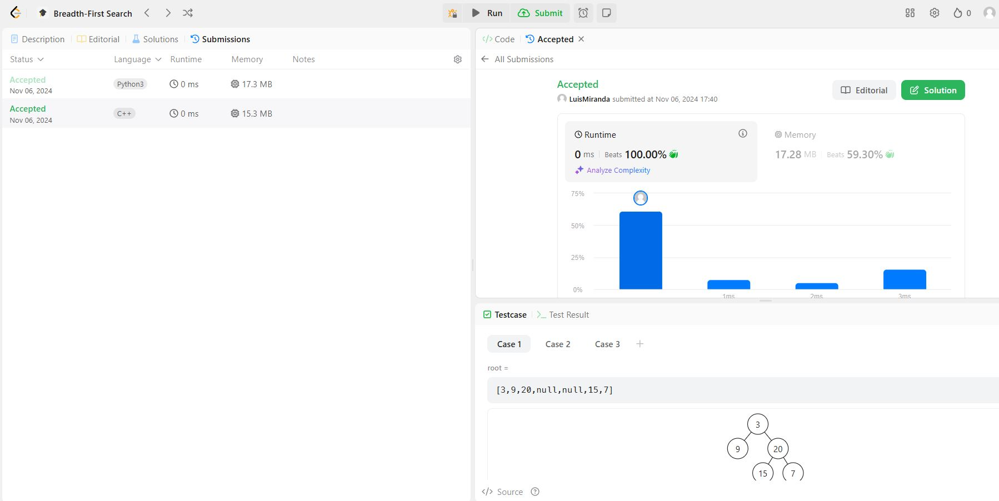
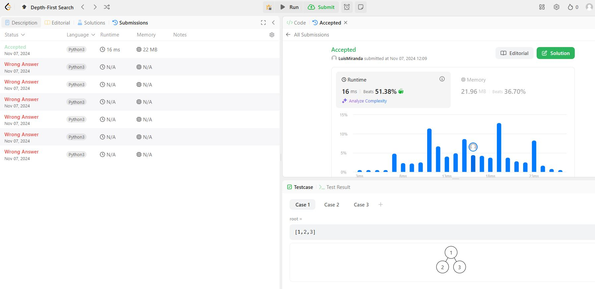
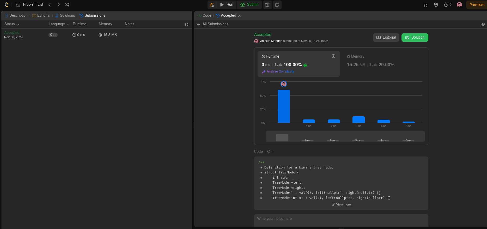

# Problemas do LeetCode envolvendo Grafos

Questões de Grafos resolvidas no LeetCode pelos alunos Luis Miranda e Vinicius Mendes

**Número da Lista**: 1
**Conteúdo da Disciplina**: Grafos 1

## Alunos
|Matrícula | Aluno |
| -- | -- |
| 21/1063200  |  LUIS EDUARDO CARNEIRO MIRANDA |
| 21/1063265 |  VINICIUS MENDES MARTINS |

## Sobre 
Resolução de questões da plataforma LeetCode que contemplam os níveis médio e difícil de dificuldade.
O objetivo é abordar o conteúdo lecionado em sala de aula de forma simples e intuitiva, com códigos facilmente legíveis.

Os exercícios abordados são os seguintes
| Código do Problema | Nome do Problema | Dificuldade |
| ------------------ | ---------------- | ----------- |
| 102. | [Binary Tree Level Order Traversal](https://leetcode.com/problems/binary-tree-level-order-traversal/description/?envType=problem-list-v2&envId=breadth-first-search)| Médio |
| 124. | [Binary Tree Maximum Path Sum](https://leetcode.com/problems/binary-tree-maximum-path-sum/?envType=problem-list-v2&envId=depth-first-search&difficulty=HARD) | Difícil |
| 968. | [Binary Tree Cameras](https://leetcode.com/problems/binary-tree-cameras/description/?envType=problem-list-v2&envId=depth-first-search&difficulty=HARD) | Difícil |

## Screenshots

### Binary Tree Level Order Traversal

### Binary Tree Maximum Path Sum

### Binary Tree Cameras

## Vídeo explicando cada questão

[Binary Tree Level Order Traversal](https://youtu.be/OyWmDNelpIo)
[Binary Tree Maximum Path Sum](https://youtu.be/PVT_6X1uwjs)
[Binary Tree Cameras](https://youtu.be/ZJqXDty2WD0)

## Instalação 
**Linguagem**: C++ e Python

## Uso 
Para testar os códigos, basta entrar na plataforma [LeetCode](https://leetcode.com/), procurar pelos exercícios e colar na aba Code.
